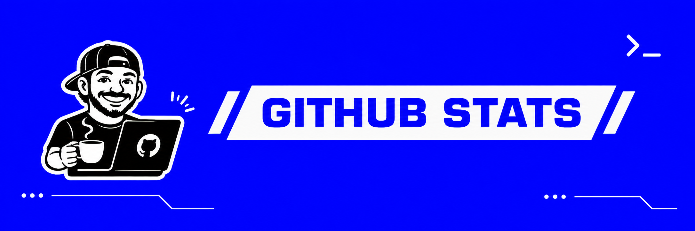
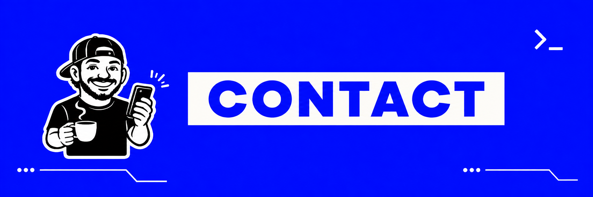

<div align="center">


<br>


<br><br>


<br><br>


</div>

---

<div align="center">
  
</div>

<br>

<table>
  <tr>
    <td width="60%" valign="top">

## 👋 Olá, eu sou Constantino

Sou estudante de **Análise e Desenvolvimento de Sistemas (ADS)** e apaixonado por tecnologia.  
Meu foco está em **Linux, redes, infraestrutura, desenvolvimento, automação e cibersegurança**.

Gosto de transformar ideias em projetos com **identidade visual, propósito técnico e aplicação prática**.  
Aqui no GitHub, eu uso cada repositório como parte da minha construção profissional e técnica.

### 🧠 O que você vai encontrar por aqui

- 🐧 Projetos baseados em **Linux**
- 💻 Aplicações e experiências em **Python** e **C**
- 🌐 Estudos e projetos de **redes e infraestrutura**
- 🔐 Interesse crescente em **cibersegurança**
- ⚙️ Testes com **automação, scripts e IA**
- 🛠️ Soluções práticas ligadas a **suporte técnico**

> Meu objetivo é construir um portfólio que una **qualidade técnica, consistência visual e evolução real**.

   </td>
   <td width="40%" valign="top">

### ⚡ Quick Profile

```yaml
name: Constantino
username: SEU_USUARIO
role: ADS Student
focus:
  - Linux
  - Python
  - C
  - Networks
  - Cybersecurity
mindset: build > learn > improve
```

### 📌 Atualmente

```text
[+] Estudando Linux
[+] Evoluindo em Python e C
[+] Criando projetos próprios
[+] Estruturando portfólio no GitHub
```

   </td>
  </tr>
</table>

---

<div align="center">
  
</div>

<br>

<div align="center">

### 💻 Linguagens


<br><br>

### 🐧 Sistemas e Ferramentas


<br><br>

### 🎯 Áreas de Interesse


<br><br>


</div>

---

<div align="center">
  
</div>

<br>

<div align="center">

<table>
  <tr>
    <th align="left">Projeto</th>
    <th align="left">Descrição</th>
    <th align="left">Stack / Foco</th>
  </tr>
  <tr>
    <td><b>🏛️ Odyssey OS</b></td>
    <td>Distribuição Linux personalizada baseada em Debian, com foco em identidade visual, experiência do usuário e integração entre aplicações.</td>
    <td>Linux • Debian • XFCE • Shell Script • UI/UX</td>
  </tr>
  <tr>
    <td><b>📂 Hermes</b></td>
    <td>Explorador de arquivos com identidade própria para o ecossistema Odyssey OS, com foco em usabilidade, personalização e acessibilidade.</td>
    <td>C • Linux • Desktop App • Acessibilidade</td>
  </tr>
  <tr>
    <td><b>✍️ Calíope</b></td>
    <td>Editor de texto com proposta moderna, visual autoral e experiência consistente com o restante do sistema.</td>
    <td>Productivity • UI/UX • Desktop App</td>
  </tr>
  <tr>
    <td><b>🌐 Argo</b></td>
    <td>Navegador de internet pensado para integrar a linguagem visual e a proposta do ecossistema Odyssey.</td>
    <td>Browser • Web • Linux • Interface</td>
  </tr>
  <tr>
    <td><b>🎮 Ágora: Crônicas de Atena</b></td>
    <td>RPG educacional multidisciplinar em Python, com foco em tecnologia, lógica, cidadania digital e cibersegurança.</td>
    <td>Python • Pygame • Educação • Gamificação</td>
  </tr>
</table>

</div>

<br>

<div align="center">

### 🚀 Estrutura de portfólio sugerida

```text
📦 OdysseyOS
 ┣ 📂 Hermes
 ┣ ✍️ Caliope
 ┣ 🌐 Argo
 ┗ 🎮 Agora-Cronicas-de-Atena
```

</div>

---

<div align="center">
  
</div>

<br>

<div align="center">


<br><br>


<br><br>


</div>

---

## 🧭 Minha trajetória

<div align="center">

```text
Suporte Técnico
      │
      ▼
Redes e Infraestrutura
      │
      ▼
Linux + Desenvolvimento
      │
      ▼
Cibersegurança
```

</div>

<br>

<div align="center">


</div>

---

<div align="center">
  
</div>

<br>

<div align="center">

<a href="https://github.com/SEU_USUARIO">
  
</a>
<a href="SEU_LINKEDIN">
  
</a>
<a href="mailto:SEU_EMAIL">
  
</a>

<br><br>

### `Build · Learn · Automate · Repeat`


</div>

<!--
PERSONALIZAÇÃO RÁPIDA

1. Troque SEU_USUARIO pelo seu usuário do GitHub.
2. Troque SEU_LINKEDIN pelo link completo do seu LinkedIn.
3. Troque SEU_EMAIL pelo seu e-mail.
4. Suba a pasta "assets" junto com este README.
5. Se algum widget não funcionar, verifique se o username foi substituído corretamente.
-->
