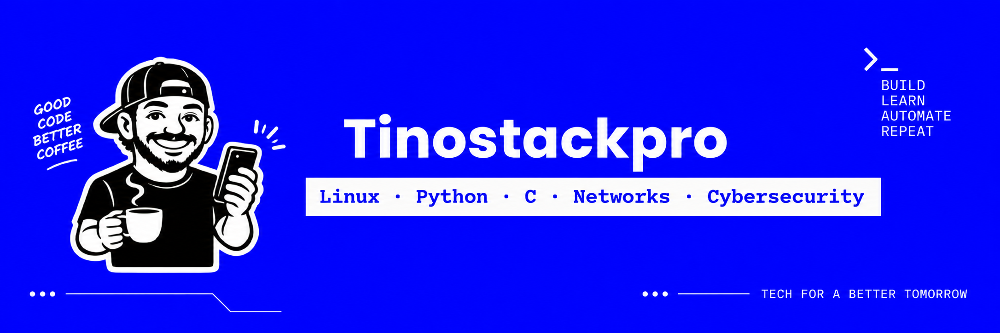
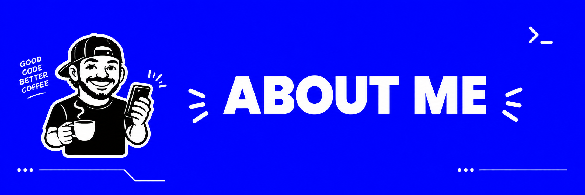
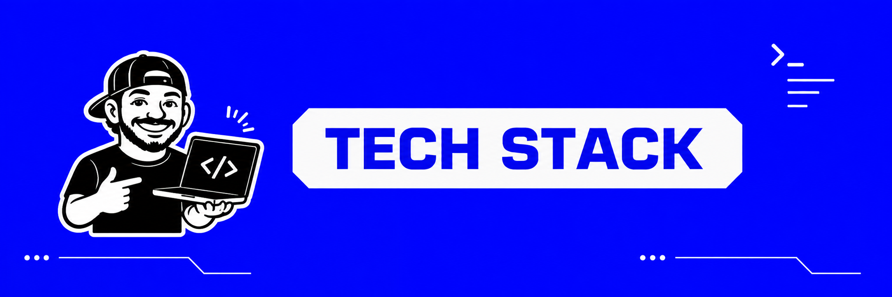
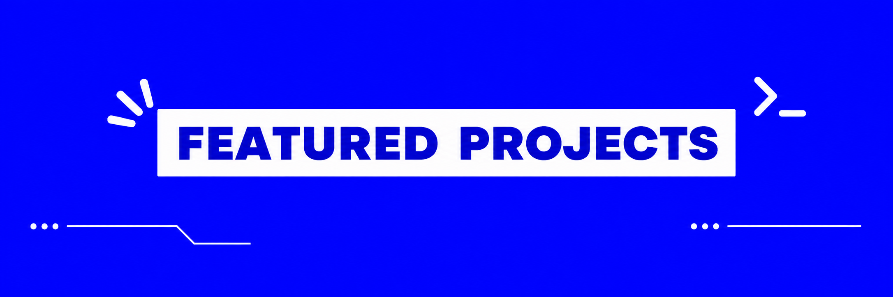
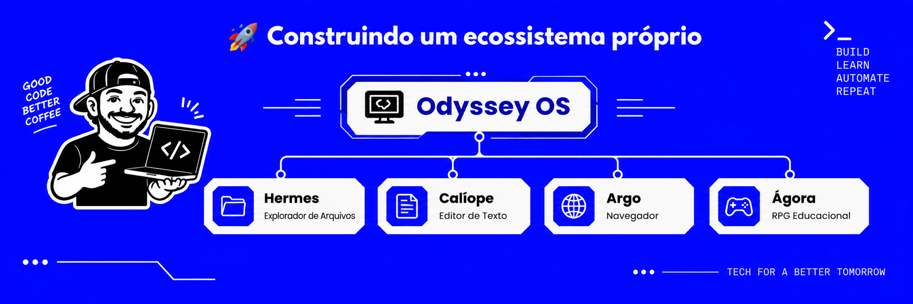

<div align="center">



<br>


<br>


</div>

---

<div align="center">
  
</div>

<br>

<table>
  <tr>
    <td width="60%" valign="top">

## 🦾 Faaala, aqui é o Constantino

Sou estudante de **Análise e Desenvolvimento de Sistemas (ADS)** e apaixonado por tecnologia.

Meu foco está em **Linux, redes, infraestrutura, desenvolvimento, automação e cibersegurança**.

Gosto de transformar ideias em projetos com **identidade visual, propósito técnico e aplicação prática**. Aqui no GitHub, uso cada repositório como parte da minha evolução profissional e técnica.

### 🧠 O que você vai encontrar por aqui

- 🐧 Projetos baseados em **Linux**
- 💻 Aplicações e experiências em **Python** e **C**
- 🌐 Estudos e projetos de **redes e infraestrutura**
- 🔐 Projetos e estudos em **cibersegurança**
- ⚙️ **Automação, scripts, IA e LLMs**
- 🛠️ Soluções práticas ligadas a **suporte técnico**

> Meu objetivo é construir um portfólio que una **qualidade técnica, consistência visual e evolução real**.

   </td>
   <td width="40%" valign="top">

### ⚡ Quick Profile

```yaml
name: Constantino
username: tinostackpro
role: ADS Student | IT Maintenance & Support
focus:
  - Linux
  - Python
  - C
  - Networks
  - Cybersecurity
  - Automation
mindset: build > learn > improve
```

### 📌 Atualmente

```text
[+] Estudando Linux
[+] Evoluindo em Python e C
[+] Aprofundando redes
[+] Criando projetos próprios
[+] Estruturando portfólio
[+] Explorando IA e LLMs
```

   </td>
  </tr>
</table>

---

<div align="center">
  
</div>

<br>

<div align="center">

### 💻 Linguagens


<br>

### 🐧 Sistemas e Ferramentas


<br>

### 🎯 Áreas de Interesse


</div>

---

<div align="center">
  
</div>

<br>

<table>
  <tr>
    <th align="left">Projeto</th>
    <th align="left">Descrição</th>
    <th align="left">Stack / Foco</th>
  </tr>
  <tr>
    <td><b>🏛️ Odyssey OS</b></td>
    <td>Distribuição Linux personalizada baseada em Debian, com foco em identidade visual, experiência do usuário e integração entre aplicações.</td>
    <td>Linux • Debian • XFCE • Shell Script • UI/UX</td>
  </tr>
  <tr>
    <td><b>📂 Hermes</b></td>
    <td>Explorador de arquivos desenvolvido para o ecossistema Odyssey OS, com foco em usabilidade, personalização e acessibilidade.</td>
    <td>C • Linux • Desktop App • Acessibilidade</td>
  </tr>
  <tr>
    <td><b>✍️ Calíope</b></td>
    <td>Editor de texto com proposta moderna, identidade visual própria e experiência consistente com o restante do ecossistema.</td>
    <td>Productivity • UI/UX • Desktop App</td>
  </tr>
  <tr>
    <td><b>🌐 Argo</b></td>
    <td>Navegador de internet pensado para integrar a linguagem visual e a proposta do ecossistema Odyssey.</td>
    <td>Browser • Web • Linux • Interface</td>
  </tr>
  <tr>
    <td><b>🎮 Ágora: Crônicas de Atena</b></td>
    <td>RPG educacional multidisciplinar em Python, com foco em tecnologia, lógica, cidadania digital, comunicação e cibersegurança.</td>
    <td>Python • Pygame • Educação • Gamificação</td>
  </tr>
</table>

<br>

<div align="center">

<br>

<div align="center">
  

</div>

---

<div align="center">


</div>

<div align="center">

<a href="https://github.com/tinostackpro">
  
</a>

<a href="https://www.linkedin.com/in/tinostackpro/">
  
</a>

<a href="https://instagram.com/tinostackpro">
  
</a>

<br>

### `Build · Learn · Automate · Repeat`

<br>


<br><br>

**Obrigado por visitar meu perfil.**

</div>
